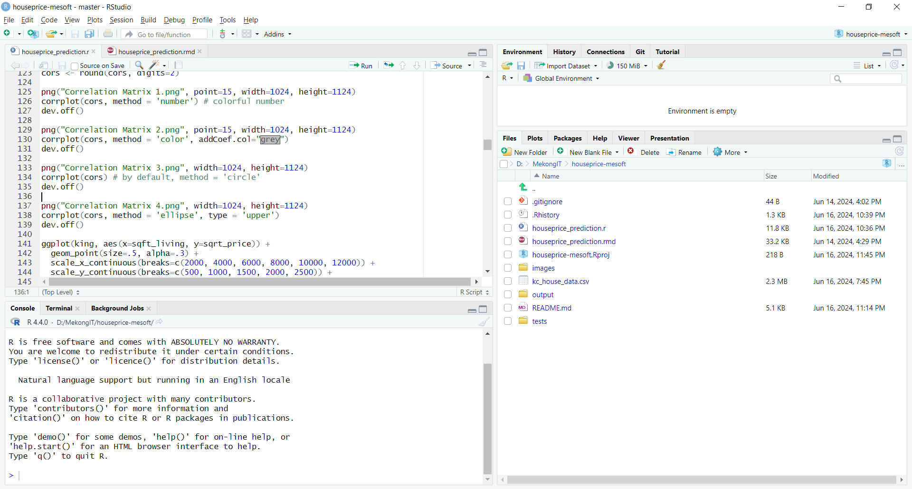

# houseprice-demo

This project is written by R language (using RStudio)

Demo Data for online House Price Prediction.

The Foghlaim Meaisin Software recently launched the Foghlaim Meaisin House Price Prediction software

Our homepage is here

https://foghlaimmeaisin.com/

You can try our demo data onto the Gas Price Prediction System here

https://github.com/mekongsoft/houseprice-demo

# Correlation Matrices

# House Price Distribution

# Pricing Relationships

# The most accuracy prediction models

## Random Forest

MSE = 10343.94

## Linear Regression

MSE = 13040.87

## Principal Component Regression

MSE = 13045.89

## Partial Least Squares Regression

MSE = 13078.88

# R language and RStudio

This Repo is for Marketing Demo tasks.

https://github.com/mekongsoft/houseprice-demo

COPYRIGHT@2024 OF FOGHLAIM MEAISIN SOFTWARE, CALGARY, ALBERTA, CANADA.
